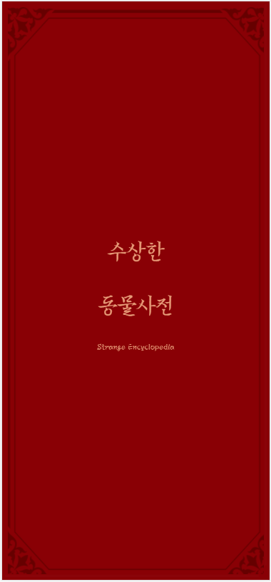

# 특화 프로젝트 - 수상한 동물 사전(AI)

 ## 🐱‍💻 5252

| 이름          | 담당           |
| ------------- | -------------- |
| 김영수 (팀장) | AI + 풀 스택   |
| 구동엽        | 서버 + 백 엔드 |
| 이경민        | 백 엔드        |
| 이은재        | AI 개발        |
| 임혜민        | 프론트 엔드    |

## 목차

1. 수상한 동물 사전 프로젝트란?
2. 수상한 동물 사전 프로젝트 정보
   1. 사용 기술 스택
   2. Git Convention
   3. 와이어 프레임
   4. 사용 패키지, 라이브러리 등
3. 사용한 코드 리뷰
## 1. 수상한 동물 사전 프로젝트란?   

**수상한 동물 사전** 프로젝트는 스캔 AI기술을 이용한 나만의 동물 도감 & 동물 분석입니다. 

'일상생활에서 만나는 동물의 종류가 궁금하신 분', '자신과 비슷한 동물을 궁금해 하시는 분'을 위해 **AI 동물 분석 도감**을 만들었습니다.

**「누구나 쉽고 간편하게 동물을 식별할 수 있고, 재밌게 자신과 닮은 동물을 만들 수 있는 모바일 웹」**을 목표로 합니다.

현재 총 100종의 동물이 있고 더욱 늘릴 예정입니다.

### 특징

- 언제 어디서나 동물, 인물 사진만 있으면 100종의 동물 중 같거나 비슷한 AI가 순식간에 검색해줍니다.
- 내가 닮은 동물 무엇인지 확인해 볼 수 있습니다.
- 여러분의 사진과 충분한 해설로 동물의 정보를 제공합니다.
- 커스터마이즈를 통해 하나 뿐인 나만의 동물 도감을 만들 수 있습니다.




## 2. 수상한 동물 사전 프로젝트 정보

> 프로젝트를 시작하며 사용하게 되는 기술 스택 및 팀 룰에 관한 내용입니다.

### 2-1. 기술 스택 

-------------------------


### 2-2. Git Convention

---

#### 2-2-1. Git-Branch

Git-flow는 다음과 같이 정해져있습니다.

- master : 배포 가능한 상태 브랜치
- develop : 업데이트 할 브랜치 + Docs 업데이트 브랜치
- feature : 기능을 개발하는 브랜치

#### 2-2-2. Git-commit

```bash
$ git commit -m "Jira 이슈 번호 | Header | 설명"
```

- JIRA 이슈 번호 or README
- Header
  - Initial : 가장 처음 만든 코드
  - Update : 정상적으로 동작하면서 수정/추가/보완된 코드
  - Fix : 비정상 동작 수정 코드

### 2-3. 와이어 프레임 & ERD

-----------------------------------

- [와이어프레임](https://github.com/DongyeopGu/animal-predict/blob/master/wireframe_ver0.2.1.pdf)


### 2-4. 사용 패키지, 라이브러리

---

> `Project/frontend`의 `node_module`폴더와 `Project/backend`의 `requirements.txt` 참고.


## 3. 사용한 코드 리뷰

### 3-1. 이미지 분석 & 저장을 위한 코드

> 이미 만들어둔 pb파일을 django에서 편하게 사용하기 위해 폴더를 옮겨서 사용함.

 ```python
def run_inference_on_image(imagePath, labelsFullPath): # 이 함수를 통해 받은 이미지를 분석하여 상위 5개 동물을 return
    answer = None

    if not tf.gfile.Exists(imagePath):
        tf.logging.fatal('File does not exist %s', imagePath)
        return answer

    image_data = tf.gfile.FastGFile(imagePath, 'rb').read()

    # 저장된(saved) GraphDef 파일로부터 graph를 생성한다.

    with tf.Session() as sess:

        softmax_tensor = sess.graph.get_tensor_by_name('final_result:0')
        predictions = sess.run(softmax_tensor,
                               {'DecodeJpeg/contents:0': image_data})
        predictions = np.squeeze(predictions)

        top_k = predictions.argsort()[-5:][::-1]  # 가장 높은 확률을 가진 5개(top 5)의 예측값(predictions)을 얻는다.
        f = open(labelsFullPath, 'rb')
        lines = f.readlines()
        labels = [str(w).replace("\n", "") for w in lines]
        result = []
        i = 1
        for node_id in top_k:
            human_string = labels[node_id]
            score = predictions[node_id]
            result.append({i:human_string[2:-3]}) # 동물의 이름만 가져오기 위해
            i += 1
        return result[:5] # 상위 다섯종류의 동물을 return

@api_view(['POST'])
def upload_image(request):
    img_string = request.data['img_base64'] # Post 요청으로  base64로 인코딩된 이미지를 받아옴
    imgdata = base64.b64decode(img_string) # base64 정보를 디코딩하여 이미지로 변경
    filename = f'temp_image_{request.user}.jpg' # 잠시 저장할 파일명
    with open(filename, 'wb') as f:
        f.write(imgdata)
    config = ConfigProto(
            device_count = {'GPU': 0}
        )
    config.gpu_options.allow_growth = False
    session = InteractiveSession(config=config)
    modelFullPath = './tmp/output_graph.pb'
    with tf.gfile.FastGFile(modelFullPath, 'rb') as f:
        graph_def = tf.GraphDef()
        graph_def.ParseFromString(f.read())
        _ = tf.import_graph_def(graph_def, name='')
    result = run_inference_on_image(filename, './tmp/output_labels.txt')
    os.remove(filename) # 분석이 끝나고 결과가 나오면 만들어둔 파일 삭제
    return Response({'result' : result})

@api_view(['POST'])
@permission_classes([IsAuthenticated]) # 인증된 사용자만 요청을 받음
def save_image(request):            # 이미지를 DB에 저장하기 위해
    img_string = request.data['img_base64'] # 위와 동일
    img_result = request.data['result']  # 위에서 분석한 결과도 가져옴
    imgdata = base64.b64decode(img_string) # 위와 동일
    now = datetime.now()	# 파일명을 겹치지 않게 하기위해 요청시 현재시간을 가져와여 파일명에 넣어서 사용
    now = datetime.timestamp(now)
    filename = f'{img_result}_{request.user}_{now}.jpg'
    dir_list = os.listdir(settings.MEDIA_ROOT+'/users/')  
    # 로그인한 사용자 이름으로 폴더를 만들어 저장하여 나중에 쉽게 관리하기 위해 유저이름에 맞는 폴더생성
 	# 이미 폴더가 만들어진 경우에는 새로 만들지 않음
    if str(request.user) not in dir_list:
        os.makedirs(settings.MEDIA_ROOT+'/users/'+f'{request.user}/')
    media_root = settings.MEDIA_ROOT+'/users/'+f'{request.user}/'+filename
    with open(media_root, 'wb') as f:
        f.write(imgdata)
    animal = get_object_or_404(Animal, english_name=img_result)
    # 이미지를 저장하며 db에 이미지 저장 경로도 저장
    animal_image = AnimalImage.objects.create(
        upload_image=f'users/{request.user}/{filename}',
        animal=animal,
        upload_user=request.user
    )
    # DB 도감에도 저장
    encyc = Encyclopedia.objects.create(
        user=request.user,
        image=animal_image
    )
    return Response({'message': '저장 완료'})
 ```